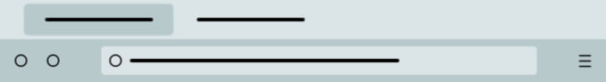

# Themes for Firefox

## Private Theme (Dark)

A dark theme from the Vivaldi browser with purple as the main color.

[Firefox Addons](https://addons.mozilla.org/en/firefox/addon/private-theme-dark)

## Green Theme (Dark)

A dark theme from the Chrome browser with green as the main color.

[Firefox Addons](https://addons.mozilla.org/en/firefox/addon/green-theme-dark)

## Green Theme (Light)

A light theme from the Chrome browser with green as the main color.

[Firefox Addons](https://addons.mozilla.org/en-US/firefox/addon/green-theme-light)

## My Firefox Settings

[Github repository](https://github.com/smcnikita/my-firefox-settings)
